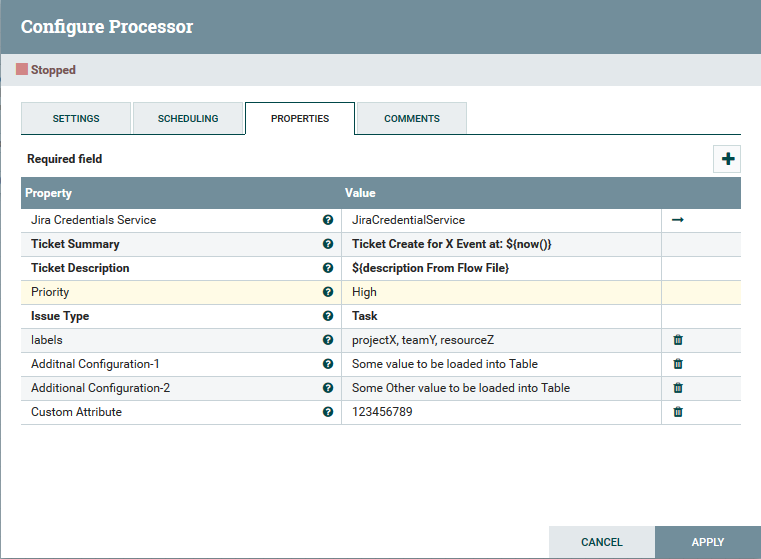
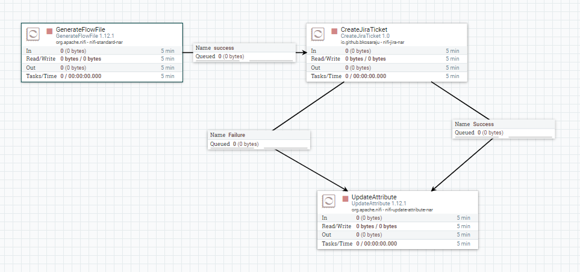

# nifi-jira-bundle

Utils is a NiFi Custom Processor and Controller Service which can be Used to cerate Jira Tickets.

Credentials(User,Password,Project Name, URL) needs to be fed to Processor from controller service, which gives the flexibly that multiple processors can use the same credentials which gives one place change for all processors.

Controller Service
------------------


Processor
---------
The processor can be configured with ticket summary and descriptions and additional information.

any of the additional attributes to the processor will be printed as markdown table.

if a attribute named as labels (comma separated list be set as labels to the app)



Sample flow
----------


Jira Ticket
-----------


Where can I get the latest release?
-----------------------------------
You can download source from [SCM](https://github.com/bkosaraju/nifi-jira-bundle).

## Build Instructions 

```bash
./mvnw clean install
#Artifacts can be found in target directory 
```

## Contributing
Please feel free to raise a pull request in case if you feel like something can be updated or contributed

## License
[Apache](http://www.apache.org/licenses/LICENSE-2.0.txt)
