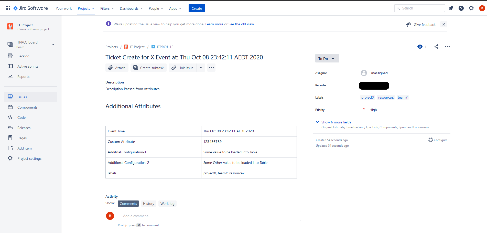

# nifi-jira-bundle

NiFi Custom Processor and Controller Service which can be Used to create Jira Tickets from NiFi.

Credentials(User,Password,Project Name, URL) needs to be fed to Processor from controller service, 
this gives the flexibly for multiple processors can use the same credentials that means one place to change connection details for all processors.

Controller Service
------------------


Processor
---------
The processor can be configured with ticket summary and descriptions and additional information.

any of the additional attributes to the processor will be printed as markdown table.

if a attribute named as labels (comma separated list be set as labels to the app)


Sample flow
----------


Jira Ticket
-----------


Sample code
-----------
[Demo Code](examples/SampleJiraTicketCreation.xml)

Where can I get the latest release?
-----------------------------------

Pre compiled binaries can be downloaded from [Maven Central](https://repo1.maven.org/maven2/io/github/bkosaraju/nifi-jira-nar/)

You can download source from [SCM](https://github.com/bkosaraju/nifi-jira-bundle).

## Build Instructions 

```bash
./mvnw clean install
#Artifacts can be found at nifi-jira-nar/target/nifi-jira-nar-<version>.nar  
```

## Contributing
Please feel free to raise a pull request in case if you feel like something can be updated or contributed

## License
[Apache](http://www.apache.org/licenses/LICENSE-2.0.txt)
